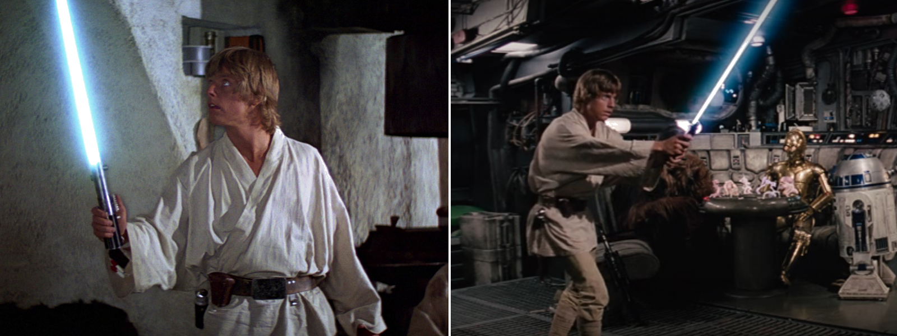
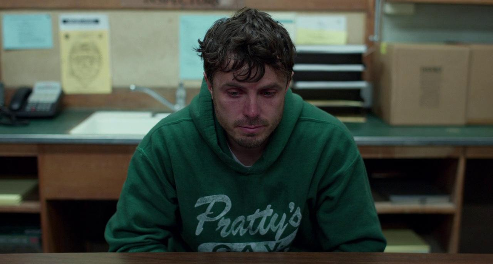

I don't recall the last time I was truly eager to watch a new film. For the better part of this decade, an emptiness has haunted me after the credits roll; one that words struggle to capture. Not only do I hardly ever watch new releases, I've sort of lost interest in watching films in general. I have over 1,100 entries on my Letterboxd, yet the frequency with which I add new films has substantially declined, to the point where I might go several months without watching a film. It feels like I've watched so many good ones already, and there's nothing new to look forward to. When I watch a trailer for a new release, I can't really place what's wrong with it; it is familiar, yet strangely vacant.

I felt this recently while watching the trailer for <i>The Bride! (2026)</i>. On paper, it has everything a promising film could ask for: Christian Bale(!), a cast of established actors, a classic story retold with modern sensibilities (in this case, a feminist angle), and a substantial budget of $80 million. Yet... nothing. As the trailer ended, so did any desire to see the film. <i>Have I seen this before?</i> I asked myself. I was immediately reminded of <i>Joker: Folie à Deux</i>, a film I had no interest in. It was apparent just from the trailer how similar they are, and I could only assume this was going to be a deflated, shallow and somewhat pretentious attempt at cash-grabbing the uh... "success" of <i>Folie à Deux</i>. I suppose Maggie Gyllenhaal, the director of <i>The Bride</i>, did not anticipate that <i>Folie à Deux</i> would be such a giant flop. I found this whole scenario sort of funny, because <i>Joker: Folie à Deux</i> was a watered-down attempt at capturing <i>Joker (2019)</i>, so <i>The Bride</i> appeared to be an even more watered-down attempt at capturing a watered-down attempt.

Not long before, I had watched the trailer for another Christian Bale film, <i>Amsterdam (2022)</i>. Bale is one of my favorite actors, and I try to keep up with his work. But I had the same reaction: something felt off, like a cheap imitation. The trailer seemed to chase a quirky Wes Anderson "vibe", mixed with some weird <i>Silver Linings Playbook</i>-type "vibe", leaving me miffed. I looked up the director, and it turns out it was actually the same director as <i>Silver Linings Playbook</i>. Okay, maybe you could just chalk up the distaste to simply not liking that specific director or his films. But something was still strange about it. I didn't recall his films to be quip-filled, or filmed like Wes Anderson parodies; even if they weren't to my taste. With no upcoming Bale films to anticipate, I resigned myself to rewatching his previous works.

<a href="https://www.youtube.com/watch?v=5tmxfVWDgMM" target="_blank">The Marvelization of Cinema</a> explains the term "marvelization"; where storytelling follows the Marvel Cinematic Universe (MCU) formula of making movies -- it's not used in a flattering way (Marvel fans, you can look away now). The idea is that, since Marvel became the most commercially successful media franchise in the 2010s, its formulas and structures are therefore to be copied. The formula consists of quips + CGI climax + sequel hook, IP recycling instead of new ideas, and content made to sustain a brand rather than to stand as art.

The video introduces a term the narrator calls <i>anti-entropic storytelling</i>, where every element of a film: theme, character, mood -- radiates from a condensed, symbolic core. <i>Entropic</i> storytelling, by contrast, dissipates meaning over time. The lightsaber in <i>Star Wars (1977)</i> is used as an example of this; it is more than a weapon; it embodies a philosophy of combat, a rite of passage, and the romance of the Jedi order. Yet with each sequel, prequel, and spin-off, the lightsaber becomes less metaphor and more prop. It mutates into a novelty and every new iteration adds variation, but little new meaning. The symbol disperses. What was once a crystalline metaphor becomes a toy catalog. This is entropy in action: the slow degradation of an idea through repetition, expansion, and overexposure.

<figure>  <figcaption>Star Wars: Episode IV - A New Hope (1977)</figcaption> </figure>

While I largely agree with the sentiment of the video, my gripe is with the term <i>entropy</i> itself used here as a metaphor. Entropy suggests inevitability, a natural decline, as though storytelling in cinema is doomed to degrade. In thermodynamics, entropy measures the tendency toward disorder; in information theory, it gauges unpredictability. Both imply a system spiraling beyond control. Cinema is not doomed. Dilution is intentional. It is the product of human choices, industrial priorities, and audience demand. Using <i>entropy</i> here is cynical, because the concept itself is. I think this type of narrative failure has always been present in the world of film, and Marvel is only responsible for furthering its popularity.

<h2>Narrative Dilution</h2>

<i>Dilution</i> resonates more deeply than entropy. It is not chaos, but fading; a deliberate loss of potency. It comes from choices made behind the scenes: what the filmmaker intends (or lackthereof), what the studio calculates, and what audiences reward.

There is <strong>thing</strong>, and then there is <strong>like thing.</strong> 
<strong>Thing</strong> already exists, but we can make this new product <strong>like thing</strong> and it will be just as good, right?

No.

Terms like <a href="https://tvtropes.org/pmwiki/pmwiki.php/Main/Flanderization" target="_blank"><i>Flanderization</i></a> capture specific examples of this in character work. Marvelization captures it at scale: the assumption that familiarity and repetition are sufficient. Consider the <i>X-Men</i> films. The 2000 trilogy existed in earnest, with its own identity, despite being comic-based. <i>X-Men: First Class (2011)</i> wanted to echo that success, but fell flat on its face in comparison. Why? These reboot films had a cast of popular actors, the same director as <i>X2 (2003)</i>, a high budget, adapted from prior material with a modern... hey, this is starting to sound familiar. It lacked the vitality of the original. It was "like" the predecessor, but not the thing itself, and the result felt hollow. Television suffers from the same problem, not just cinema. <i>Game of Thrones</i> would be an easily example here, but mentioning how it fell from grace and basically cannibalized itself would be like beating a dead horse.

A more apt example would be the success of <em>Stranger Things (2016)</em> and the wave of copycats that followed over the past nine years. What makes <em>Stranger Things</em> interesting is that, while it banks on 80s nostalgia, it has enough identity to stand on its own instead of relying solely on nostalgia-baiting. Much of its charm comes from the child actors, who brought distinct personalities rather than recycled 80s-era tropes. In some cases, the show even subverted those clichés, creating a palatable experience where modern audiences could both relate to the characters and still see them as products of their in-universe time. A year after its breakout success, <em>It (2017)</em> arrived, openly aping the "vibe" and style of the show. Just two years later came <em>It Chapter Two</em>, doing the same thing with even poorer fanfare. The most recent <em>Ghostbusters</em> films, <em>Afterlife</em> and <em>Frozen Empire</em>, take this even further, doubling down on nostalgia while layering on the quippy, Marvelized tone. And if the formula isn't obvious from that lineup alone, consider this: Finn Wolfhard, the star of <i>Stranger Things</i> appears in every single one: <em>Stranger Things</em>, <em>It</em>, <em>It Chapter Two</em>, <em>Afterlife</em>, and <em>Frozen Empire</em>. Wild.

<figure>  <figcaption>Please can we just have more contemporary films like <I>Manchester by the Sea</i>?</figcaption> </figure>

<h2>Narrative Dilution... and Algorithmic Cinema</h2>

Today, narrative dilution is amplified by a combination of industrial calculation and audience expectation. Studios increasingly rely on data-driven insights. Algorithmic filmmaking is used to predict what viewers will respond to: how long attention holds, which jokes land, which archetypes succeed. Films become experiments designed for engagement rather than resonance, where originality is treated as a risk and safe formulas dominate. There is no desire to produce cinema -- only content. This, in turn, fuels a broader crisis of novelty: original ideas are seen as financial hazards, and intellectual property becomes a commodity. Sequels, prequels, and reboots dominate the landscape, leaving audiences to encounter familiar worlds endlessly recycled, hollowed of symbolic or emotional depth. The original ideas that do make their way through the cracks and land in front of a camera, tend to be too much "like" preexisting works that have already established their own success and identity. The spectacle trap compounds this effect: modern blockbusters are often stitched together like theme park rides, prioritizing CGI set pieces, franchise hooks, and visual spectacle over narrative subtlety or thematic coherence, dazzling audiences momentarily but rarely leaving lasting impact.

Yet this cycle is not imposed solely from above; audiences are complicit, rewarding comfort, nostalgia, and repetition. Easter eggs and familiar "vibes" earn applause, encouraging studios to double down on replication. Even the language surrounding film reinforces this system: movies are no longer universally considered art or entertainment but content. Something to fill a slot, a subscription, or a calendar. Metrics outweigh meaning, monetization outweighs resonance, and terminology itself conditions viewers to accept dilution as normal. Together, these forces create a feedback loop in which cinema risks losing its capacity to surprise, resonate, or endure, leaving us with films that feel increasingly hollow and preordained.

Ultimately, what we're seeing is not the inevitable decay of cinema, but a choice, a persistent preference for the familiar. Narrative dilution is a human-made phenomenon, a consequence of industrial calculation, algorithmic predictability, and audience complicity. It leaves us with films that are slick, polished, and yet strangely hollow, where spectacle replaces subtlety and repetition masquerades as innovation. And yet, the capacity for truly resonant storytelling still exists; it persists in the cracks, but recognizing dilution is the first step toward seeking cinema that still astonishes, unsettles, or moves us.