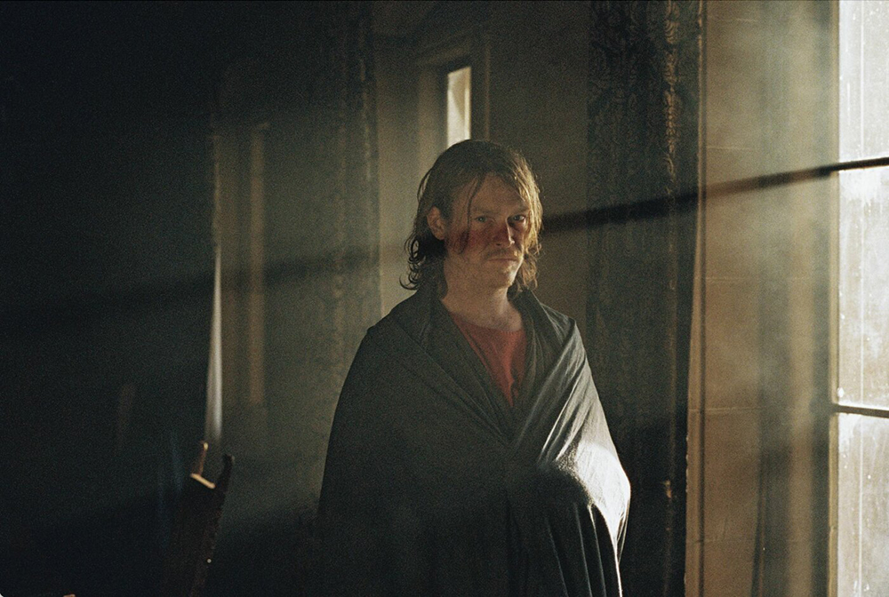
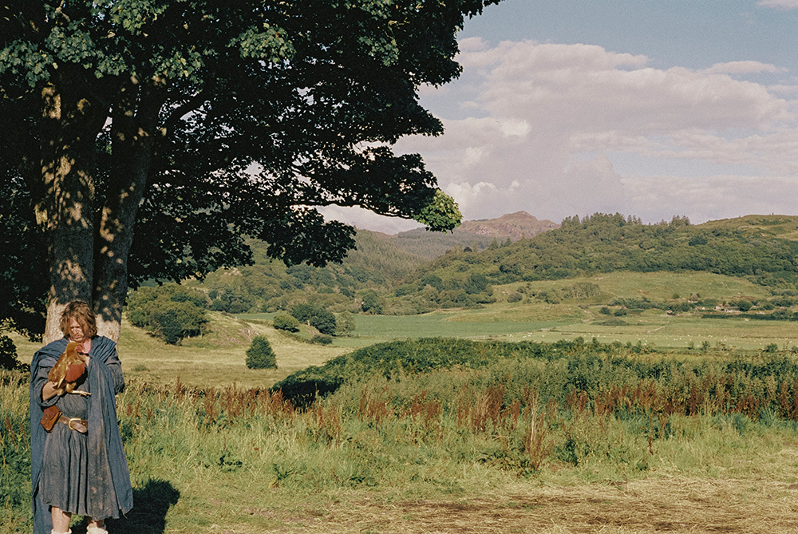
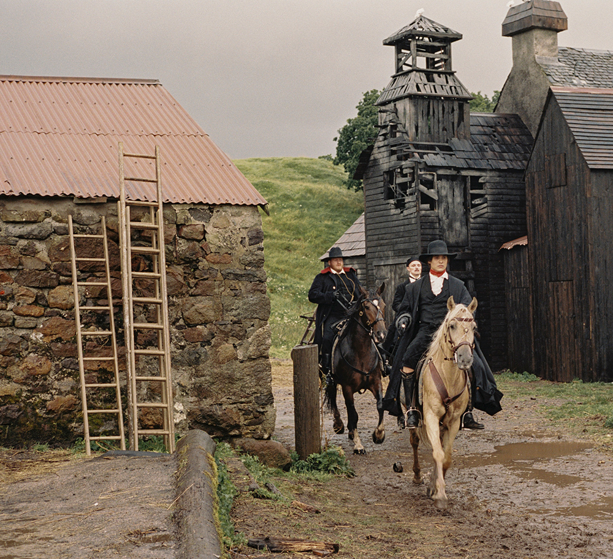
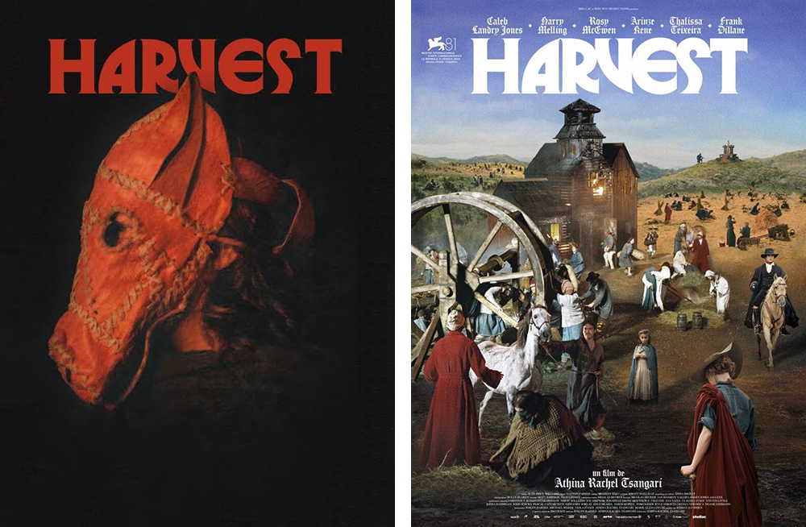

There is something almost indecent about how beautiful <i>Harvest</i> looks. Shot on 16mm, Athina Rachel Tsangari's film has that rare, tactile grandeur that recalls Kubrick at his most painterly; the beautiful scope of <i>Barry Lyndon (1975)</i>, where every frame feels composed not just for narrative or aesthetic but for moral reckoning. Light pools on moss and skin, faces are etched by weather and time, fields breathe like sentient things. You feel watched by the land as much as you watch the characters moving across it, and it is certainly one of the most beautiful looking films I've seen in a while.

The plot unfolds in a secluded Scottish village, where life revolves around the cycles of sowing and reaping. Our narrator and reluctant observer is Walter Thirsk (Caleb Landry Jones), a widower integrated into the community through his late wife, who navigates the growing tensions with a mix of curiousity and passivity. Within this distinctly Scottish geography, in a place that may or may not exist, during a time that may or may not exist, a choice sharpens the film's central metaphor: a small, communal village facing annihilation at the hands of "progress", embodied by Master Jordan (Frank Dillane), Master Kent's (Harry Melling, of <i>Harry Potter</i> fame) English cousin and the machinery of enclosure, optimisation, mapping, and profit. The villagers are a living ecology, a way of knowing the world through touch, soil, ritual, and collective memory. Against them arrives a colder epistemology: English, clinical, cartographic, one that seeks to flatten this world into lines, property, and yield. Tsangari, drawing from her Greek roots (<i>"There’s something hardened about that landscape in Western Scotland. Also, as a Greek, I felt an immediate kinship with the landscape and people in Argyllshire"</i>), relocates the English-set novel the film is based on to the Scottish Highlands, infusing it with echoes of the Highland Clearances. This choice sharpens the film's metaphors, turning it into a poignant allegory for colonialism and displacement. It is plain to see England's historic mistreatment of Scotland here, but one can draw a metaphor to England's mistreatment of just about every continent and sub-continent it set foot on to colonise: Australia, India, Africa, the list goes on.

<figure>  <figcaption>Caleb Landry Jones as Walt</figcaption> </figure>

One of the things that stuck with me most deeply was the cinematography, which is nothing short of insanely good. Immersive, textured, and alive in a way that rivals Stanley Kubrick's masterful work in <i>Barry Lyndon (1975)</i>, or Andrei Tarkovsky's <i>Stalker (1979)</i>. Like these films, <i>Harvest</i> is shot with a reverence for natural light and landscapes, using 16mm film to capture the earth's raw beauty. The camera dances through the mud and mist, often handheld and kinetic, creating a visceral sense of place where humans are shaped by the land as much as they shape it, making the village's dissolution feel like a wound to the world itself. I was left marveling at how the mundane acts of harvesting barley or shearing sheep turn into profound rituals, blending anarchy and precision in a style that's ambitious yet deeply humanistic.

Yet <i>Harvest</i> is not dour. There is a strange, feral humour running beneath it: the goat-drunk celebrations, the grotesque rituals, the absurdity of feudal politeness, the way bodies move in instinctive, almost animal pleasure. Tsangari finds comedy in the sheer awkwardness of humanity, even as the walls close in. It makes the collapse more unbearable, and more real. When the film positions the villagers as the point of identification, it unsettles the viewer, placing us in a space of discomfort where our self-image clashes with the version of ourselves we have learned to accept or perform. What emerges is a confrontation with something stark and unflattering. It is a reflection that feels uncomfortably close to reality. The villagers in this film are not wholly innocent or wholly corrupt, only shifting mixtures of both. Our principal character, Walt, through his own admission and the contempt of others, accepts that he is only part of the village community through circumstance. It doesn't take long for his reputation to dwindle, and for the untrusting nature of his peers to take a sharp turn in his direction.

<figure>  <figcaption>Lavish rural landscapes adorned with a thick 16mm grain</figcaption> </figure>

What's devastating is how the villagers participate in their own ruin. Their superstition, their suspicion of outsiders, their failure to unite, this all becomes part of the mechanism that undoes them. "Conquer and divide", or in this case, already divided. There's degrees of subjugation here, the villagers themselves displaying harsh and humiliating behaviour toward outsiders, those who have already experienced the impending doom within their own right. Tsangari never romanticises the villagers into noble innocents; even the already displaced villagers are crude and abrasive to a point of refusing any food or help. Their only goal is to encroach on a land as they see fit. Instead, Tsungari renders all the villagers as tragically human, capable of tenderness and cruelty in the same breath. The metaphor between the Scottish villagers and Master Kent's English kin is obvious, yes, but it's no less piercing for that. One group lives with the land; the other intends to own it. One understands boundaries as memory; the other as legal fiction.

At its core, <i>Harvest</i> is rich with metaphors that unfold like layers of soil. Capitalism lurks as the film's blunt force, introduced subtly through Master Kent's profit-sharing pitch, which masks the violence of optimisation and enclosure. What begins as a seemingly democratic shift of fencing off common lands for wool production, escalates into communal collapse, a prescient warning about how economic "progress" displaces cultures and erodes shared bonds. Tsangari has called it a "nihilistic western," and I find that very apt: there's no heroic redemption, just a slow unraveling where passivity enables catastrophe. The cartographer Quill (Arinzé Kene), with his quill scratching borders onto maps, "flattens" the land, symbolizing how abstraction paves the way for exploitation. Even more compelling is the metaphor between the villagers, standing in for Scotland's resilient yet doomed rural village-folk, and Master Kent's cousin, representing England's imperial hand. This dynamic hits hard, evoking the historical Clearances where English landowners cleared Scottish tenants for sheep pastures, prioritising profit over people. The villagers' reverence for their boundaries, ritually knocking children's heads on border stones, contrasts sharply with the cousin's fences, highlighting how one form of belonging is organic and communal, while the other is possessive and divisive. In our era of immigration crises and land grabs, from Gaza to global displacement, these symbols feel eerily alive, turning the film into a fable about being "passive and gullible observers to catastrophe," as Tsangari puts it.

<figure>  <figcaption>Master Jordan as finely dressed English colonialism</figcaption> </figure>

It's funny, in a wry sort of way, that <i>Harvest</i> has drawn so many bad reviews from English publications, like The Guardian, which dismissed it as an "exasperating experience" with "ploddingly unvaried pace" and labeled the English antagonists as "comically evil," perhaps recoiling from the film's unflinching gaze on their nation's history of enclosure and eviction. As though satire of imperial dispossession is somehow unfair, rather than historically accurate. It strikes me as telling, and maybe it hits too close to home, stirring discomfort about England's evil history of imperialism and exploitation. Yet for me, this resistance only underscores the film's strength: it's not a tidy historical drama but a surreal, atemporal meditation that resists easy empathy. The cast embodies this duality with raw authenticity, supported by a score that blends natural symphonies with electronic echoes of the future to come.

<i>Harvest</i> ultimately transcends its period setting. It lingers like the mist over its Scottish hills; it's a film that doesn't just depict loss but makes you feel it in your bones, through its visuals and unflinching metaphors of capitalist encroachment and colonial shadows. What Tsangari captures with such unnerving clarity is the moment just before disappearance, when a world still believes in its own continuity even as the ground beneath it is being measured, priced, and redefined. The tragedy is not only what is taken, but how inevitable the taking has been made to feel. That is to say, <i>Harvest</i> isn't just a historical allegory or a critique of capitalism, but a requiem for relational living, for cultures rooted in rhythm, season, and shared labor, for knowledge systems that refused quantification and ended in demise.

<figure>  <figcaption>The posters are also very nice</figcaption> </figure>

After my previous blog post, you can imagine my excitement after learning about this film and subsequently watching it. Modern cinema is certainly not dead! I was not impressed with <i>Frankenstein (2025)</i> at all, but between <i>Harvest</i> and <i>Dracula (2025)</i> I am indubitably impressed with Caleb Landry Jones and the films he has starred in this year. I'm very tickled to see him get so much attention after seeing him in <i>X-Men First Class</i> back in 2011, hoping he would get more work in the future. I feel his time has definitely come and I'll be catching up on his filmography for sure.